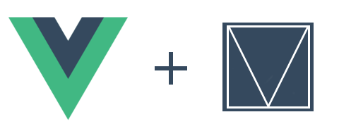

<p align="center">
  
  <br/>
  <a href="https://circleci.com/gh/posva/vue-mdl">
    
  </a>
  <a href="https://www.npmjs.com/package/vue-mdl"></a>
  <a href="http://waffle.io/posva/vue-mdl"></a>
  <br>
  <a href="https://david-dm.org/posva/vue-mdl#info=devDependencies" title="devDependency status"></a>
  <a href="https://david-dm.org/posva/vue-mdl#info=peerDependencies" title="peerDependency status"></a>
  <br>
  <a href="https://www.npmjs.com/package/vue-mdl"></a>
  <a href="https://github.com/posva/vue-mdl/blob/develop/LICENSE"></a>
</p>

#Intro

Reusable Vue components using [Material Design Lite](https://github.com/google/material-design-lite)

__Warning__: This project is still under development. Contributions are welcome

vue-mdl tries to use the latest versions of material design lite and vue

#Usage

```js
// browserify/webpack require
// Use vmdl if you're including vue-mdl directly into the browser
var vmdl = require('vue-mdl');
var Vue = require('vue');

// Globally register the checkbox
vmdl.register(Vue, 'mdl-checkbox');
// Shorthand
vmdl.register(Vue, 'checkbox');
// Globally register all components and directives
vmdl.registerAll(Vue);

// Access any component or directive
var checkbox = vmdl.components['mdl-checkbox'];
var badge = vmdl.directives['mdl-badge'];
var app = new Vue({
  components: {
    mdlCheckbox: checkbox
  },
  directives: {
    mdlBadge: badge
  }
});
```

```html
<mdl-checkbox :checked='check'>Checkbox</mdl-checkbox>
```

#Documentation

The `test/components` directory has a lot of examples used for tests.

The documentation is available [here](http://posva.net/vue-mdl)
Pull Requests and issues are welcome.

#Build

This will build a distributable version in the `dist` directory.
```bash
npm run build
```

#Test

You can run all the tests
```bash
npm test
```

##Unit tests
```bash
npm run test:unit
```

##End to End tests
```bash
npm run test:e2e
```

It is possible to test one single file by running the dev server in one terminal
and `nightwatch` in another:
```bash
npm run dev-test
```

```bash
PORT=8088 ./node_modules/.bin/nightwatch -c build/nightwatch.json --test test/e2e/checkbox.js
```

#Development

Prefer unit tests over end to end tests.

Run `npm run dev` to run a `webpack-dev-server` that will watch the project
for modifications and create the bundles. You can then visit
[http://localhost:8080](http://localhost:8080).

Create tests pages inside `test/components`. Add unit tests to `test/unit/specs`
and modify `test/unit/main.js` to load the test.

You can also serve the tests pages without running the unit tests by running
`npm run dev:test`.
This will serve the tests at `localhost:8088`.
You must add `#<component_name>` to the address. For instance, if you want to
load the checkbox example you must go to `localhost:8088/#checkbox`

#Contributing

When contributing, make sure all tests pass.
If you wrote a new feature or fixed a bug make sure to add the corresponding test.

#Releasing

Releasing is done using the git flow model

- Start a new release `git flow release start x.x.x`
- Bump package.json version
- Run `npm run build`
- Commit the version. No more info needed
- Run `git flow release finish`
- Write the changelog in the tag notes
- Push master and develop branches `git push --all`
- Push tags `git push --tags`
- Publish it to npm: `npm publish`

#License
[MIT](http://opensource.org/licenses/MIT)

Copyright (c) 2016 Eduardo San Martin Morote
